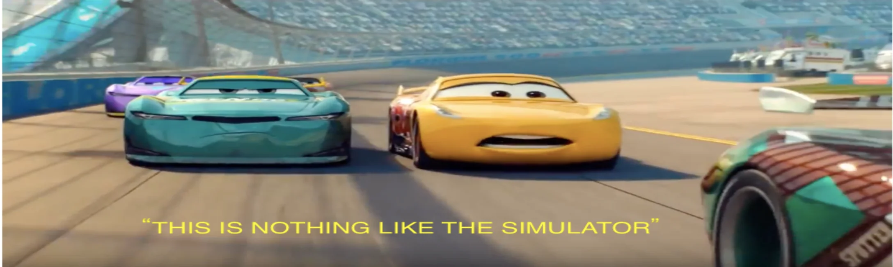

<div align="center">

  

  # Cars 3 Driven to Win - Explorer & Mod Tool

  A web-based 3D model viewer, file explorer, and mod maker for *Cars 3: Driven to Win* (Nintendo Switch).

</div>

---

## Features

- **3D Model Viewer** - Three.js/WebGL with orbit controls, wireframe, spin toggle. Loads 73+ characters directly from game ZIPs.
- **Texture Decoder** - Decodes BC1, BC3, BC4, BC5, BC7, RGBA8 textures. Backend PNG decode + client-side fallback.
- **Romfs Browser** - Browse and search ~7,979 ZIP archives containing all game assets. View files inline.
- **Script Viewer** - Scans 676 Lua scripts from inside ZIPs. Detects bytecode vs plaintext. Auto-disassembles Lua 5.1 bytecode.
- **Mod Maker** - Script editor with Lua 5.1 compiler (`luac51`). Workspace system for file editing. Ryujinx mod export (romfs + exefs).
- **Texture Encode** - Upload PNG, encode to BC3 for game use.

---

## Getting Started

### Prerequisites

- Python 3.10+ with `pillow` (`pip3 install pillow`)
- `luac51` for Lua compilation (optional, for mod script editing)

### Run

```bash
cd /path/to/Cars3mtw
python3 cars3_viewer.py
```

Open `http://localhost:8766` in your browser.

### Game Data

Place your Nintendo Switch romfs dump in `romfs/`. All game assets are inside ZIP archives.

```
romfs/
  bundles/          # Character and world bundles (actor-*.zip, zone-*.zip)
  assets/           # UI, weapons, tracks, etc.
  worlds/           # World data
```

---

## Directory Layout

```
Cars3mtw/
  cars3_viewer.py        # Backend server (Python stdlib http.server)
  viewer.html            # Frontend (Three.js model viewer + mod UI)
  world_loader.py        # OCT/VBuf/IBuf parser, texture decoder, MATP reader
  bc7_decoder.js         # Client-side BC7 texture decoder
  three.min.js           # Three.js r152
  logo.png               # App logo
  banner.png             # App banner
  romfs/                 # Game data (romfs dump as ZIPs)
  RevOctane/             # Read-only OCT/MTB/Lua parsers (reference)
  .mod_workspace/        # Mod workspace (auto-created)
  exefs/                 # Game executable data (for mod patching)
```

---

## Game File Formats

### OCT (Octane Scene Container)

Binary mesh/scene container. All characters and worlds use this format.

```
Header:
  4 bytes: Magic "OCT\x00" or similar
  ...scene hierarchy, transforms, material references

Contains:
  - Node tree (transforms, parent/child)
  - Mesh references pointing to VBuf + IBuf pairs
  - Material assignments per mesh primitive
```

Parsed by `world_loader.py:parse_oct()` and `RevOctane/octane_parser.py`.

### VBuf (Vertex Buffer)

Raw vertex data. Layout per vertex depends on stride.

```
Per-primitive header (from OCT):
  numStreams, vertCount, offsetA, strideA
  unitBase[3] (float32 x3) - position origin
  unitScale[3] (float32 x3) - position scale

Per-vertex layout (stride >= 12):
  Offset 0-5:  int16 x, y, z (normalized by unitBase/unitScale)
  Offset 8-11: float16 u, v (UV coordinates)
  Offset 12+:  varies (normals, tangents, etc.)
```

Position decode: `world = unitBase + (int16_value / 32767.0) * unitScale`

### IBuf (Index Buffer)

Triangle index data. Supports 1-byte, 2-byte, and 4-byte indices.

```
Per-primitive header (from OCT):
  ibRef, byteOffset, baseIndex, indexCount
  indexWidth (1, 2, or 4 bytes)

Index decode: raw_value - baseIndex
```

### MTB (Material Binary)

Material definitions and texture references.

```
Header (LE):
  Offset 0x1C: numTextures (uint32)

Texture entries (16 bytes each, starting at 0x28):
  Offset 0:  8 bytes - texture hash (used as filename key)
  Offset 10: uint16 - raw format code
  Offset 13: b13 - texture height hint (may not be multiple of 4)
  Offset 14: slot - texture slot (0=diffuse, 1=lightmap, 2=normal, 5=detail)

MATP section (at "MATP" magic):
  Maps material index -> texture index
```

Format codes:

| Code | Format | Block Size |
|------|--------|------------|
| 0x5E, 0x9E, 0x98 | BC3 | 16 bytes |
| 0x5C, 0x9C | BC1 | 8 bytes |
| 0x9B | BC7 | 16 bytes |
| 0x5A, 0x98 | RGBA8 | raw |
| 0x70, 0xB0 | BC5 | 16 bytes |
| 0x60, 0xA0 | BC4 | 8 bytes |

### TBody (Texture Body)

Raw compressed texture data. No header - starts directly with block data.

```
For BC3: Array of 16-byte blocks, laid out row-major in 4x4 pixel blocks.
  Block bytes 0-1:   alpha0, alpha1
  Block bytes 2-7:   48-bit alpha indices (3 bits per pixel, 16 pixels)
  Block bytes 8-9:   color0 (RGB565, little-endian)
  Block bytes 10-11: color1 (RGB565, little-endian)
  Block bytes 12-15: 32-bit color indices (2 bits per pixel, 16 pixels)

Block index = (blockY * blocksPerRow) + blockX
blocksPerRow = ceil(width / 4)
blocksPerCol = ceil(height / 4)
```

**Known issue:** Height from MTB b13 byte may not be multiple of 4. Textures with non-aligned heights (e.g. 94 instead of 96) require rounding up to nearest multiple of 4 for correct BC3 decode.

### ZIP Packaging

All game assets are stored in ZIP archives. A single character's ZIP contains:
- Multiple `.tbody` files (one per texture mip level / slot)
- One `.mtb` file (material definitions)
- Multiple `.oct` files (mesh data)
- Corresponding `.vbuf` and `.ibuf` files

Character ZIPs are in `romfs/bundles/actor-cars3_*/_root_.zip`.
World ZIPs are in `romfs/bundles/zone-cars3_*/_root_.zip`.

---

## Lua 5.1 Bytecode (Game Scripts)

The game ships ~676 Lua scripts (660 `.lua`, 10 `.sx`), all compiled to Lua 5.1 bytecode.

### Header Format (12 bytes)

```
Offset 0-3:  Signature "\x1bLua" (0x1B 0x4C 0x75 0x61)
Offset 4:    Version (0x51 = Lua 5.1)
Offset 5:    Format (0x00 = official)
Offset 6:    Endianness (0x00 = big-endian in game files, 0x01 = little-endian)
Offset 7:    Size of int (4)
Offset 8:    Size of size_t (4)
Offset 9:    Size of Instruction (4)
Offset 10:   Size of lua_Number (4)
Offset 11:   Integral flag (0 = float)
```

**Game files use big-endian (byte 6 = 0x00)** for header fields and constants, but Switch is ARM64 (little-endian). Instruction encoding endianness is still under investigation.

### Known Issues

- Game bytecode uses BE header but lives on LE hardware. Constant pool and header fields decode as BE correctly.
- Instruction word endianness is unresolved - neither pure LE nor pure BE gives correct A field extraction matching `luac51 -l` output.
- Decompilation is not possible. Scripts can be replaced by writing new Lua source and compiling with `luac51`.

---

## API Endpoints

| Endpoint | Method | Description |
|----------|--------|-------------|
| `/api/characters` | GET | List all 73 characters |
| `/api/character?id=NAME` | GET | Get character mesh + textures |
| `/api/asset?path=PATH` | GET | Load any OCT asset by path |
| `/api/browse?path=PATH` | GET | Browse romfs directory |
| `/api/file?path=PATH` | GET | Get file content |
| `/api/zip?path=PATH` | GET | List ZIP contents |
| `/api/zipfile?path=P&file=F` | GET | Get file from inside ZIP |
| `/api/search?q=QUERY` | GET | Search romfs filenames |
| `/api/scripts` | GET | List all 676 Lua scripts |
| `/api/mod/workspace` | GET | List mod workspace files |
| `/api/mod/file` | GET | Read workspace file |
| `/api/mod/file` | POST | Write workspace file |
| `/api/mod/compile` | POST | Compile Lua to 5.1 bytecode |
| `/api/mod/encode-tex` | POST | Encode PNG to BC3 |
| `/api/mod/extract` | POST | Extract from ZIP to workspace |
| `/api/mod/repack` | POST | Repack workspace into ZIP |
| `/api/mod/delete` | POST | Delete workspace file |
| `/api/mod/export` | POST | Export Ryujinx mod |
| `/api/mod/disassemble` | POST | Disassemble Lua bytecode |
| `/api/mod/romfs-zip` | GET | List romfs ZIP files |
| `/api/mod/export-check` | GET | Check export status |

---

## Mod Workflow

1. **Extract** - Pick a ZIP from romfs, extract files to workspace
2. **Edit** - Modify Lua scripts in the built-in editor
3. **Compile** - Compile Lua source to 5.1 bytecode using `luac51`
4. **Repack** - Repack modified files back into the ZIP
5. **Export** - Export for Ryujinx: copies to `romfs/`, exefs to `exefs/`, writes `ryujinx_mod.toml`

### Ryujinx Mod Structure

```
[mod_name]/
  romfs/          # Modified game files
  exefs/          # Modified executables (if needed)
  ryujinx_mod.toml
```

---

## Known Issues

- **Texture dimension bug (partially fixed):** MTB b13 byte gives heights not divisible by 4 (e.g. 94 instead of 96). Fixed in parser by rounding to `blocks_per_col * 4`. Some textures may still appear with slight visual artifacts.
- **Lua bytecode endianness:** Instruction word endianness is unresolved. Standard `luac51 -l` output doesn't match bit extraction for A field. Game files are BE header on LE hardware.
- **No decompiler:** Cannot decompile game Lua bytecode back to source. Only replacement scripting is possible.
- **GOB deswizzle:** Switch uses Tegra X1 block-linear texture storage. A deswizzle function exists in the frontend (`deswizzleGobOffset`) but is not currently applied. Textures may need GOB deswizzling for pixel-perfect decode.

---

## Credits

- **[cars3-blender-io](https://github.com/DJmax0955/cars3-blender-io)** by DJmax0955 - Format reverse-engineering
- **[RevOctane](https://github.com/zzh8829/RevOctane)** by zzh8829 - Octane engine research

---

## License

Open-source, intended for educational and research purposes.
